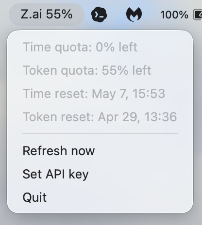

# Z.ai / GLM Quota Menubar

Lightweight macOS menu bar app for checking Z.ai quota usage, including GLM plan quota shown through Z.ai's quota endpoint.

The app is intentionally small: it shows one status item, a short dropdown, and nothing else.



```text
Menu bar: Z.ai 65%

Dropdown:
Time quota: 0% left
Token quota: 65% left
Time reset: May 7, 13:13
Token reset: Apr 29, 10:56
Refresh now
Set API key
Quit
```

## Why

Z.ai and GLM quota are easy to forget while working. This app keeps the current quota visible in the macOS menu bar without opening a dashboard, browser tab, or large desktop client.

## Lightweight Targets

This project is built around a simple target:

- Keep the packaged app tiny.
- Keep idle memory as close to 10 MB as practical.
- Avoid Electron, Tauri, webviews, background daemons, charts, history, and settings screens.

Current local measurements:

| Metric | Result |
| --- | ---: |
| `.app` bundle size | about 660 KB |
| Launch RSS | about 40 MB |
| Settled RSS after 5 minutes | 11.8-13.9 MB |

The app bundle is comfortably below 1 MB. The sub-10 MB RAM target is not yet met in the measured AppKit build; the remaining RSS appears to come mostly from the macOS AppKit status item runtime rather than the quota parser or network code.

## API Status

The app uses the unofficial endpoint:

```text
GET https://api.z.ai/api/monitor/usage/quota/limit
Authorization: Bearer <api-key>
```

Because this endpoint is not officially documented by Z.ai, it may change or stop working. The app keeps the last successful quota visible and shows a concise error row when refresh fails. GLM users may find this project while searching for GLM quota monitoring, but the implementation is still the same Z.ai quota endpoint.

## Security

- API keys are stored in macOS Keychain.
- API keys are not written to files by the app.
- No telemetry is collected.
- No usage history is stored.

If you paste an API key into an issue, chat, log, screenshot, or commit by mistake, rotate it immediately.

## Install From Source

Requirements:

- macOS
- Rust toolchain
- Xcode command line tools

Build and package:

```bash
cargo test
cargo build --release
scripts/package_app.sh
```

Install locally:

```bash
cp -R "dist/Z.ai Quota.app" "/Applications/Z.ai Quota.app"
open "/Applications/Z.ai Quota.app"
```

The packaging script creates `dist/Z.ai Quota.app` and ad-hoc signs it for local use.

## Usage

1. Launch `Z.ai Quota.app`.
2. Click `Z.ai --%` in the menu bar.
3. Choose `Set API key`.
4. Paste the full Z.ai API key and click `Save`.
5. Use `Refresh now` to update manually.

The title uses token quota left as the primary value:

```text
Z.ai 65%
```

## Development

Run tests:

```bash
cargo test
```

Build release binary:

```bash
cargo build --release
```

Package app:

```bash
scripts/package_app.sh
```

Measure memory:

```bash
pgrep -fl "Z.ai Quota"
ps -o pid=,rss=,comm= -p <pid>
```

## Design Constraints

This project should stay boring and small:

- Single Z.ai / GLM account.
- Single menu bar item.
- No charts.
- No notifications.
- No auto-update system.
- No login flow.
- No local database.

## License

MIT
